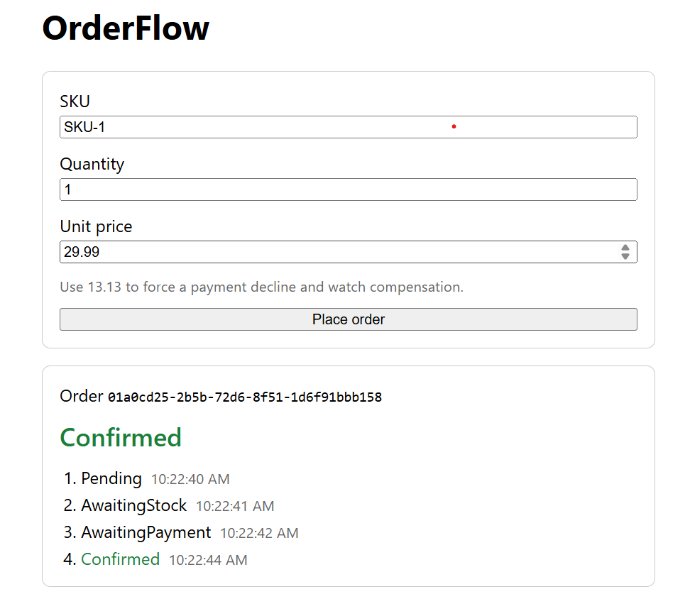
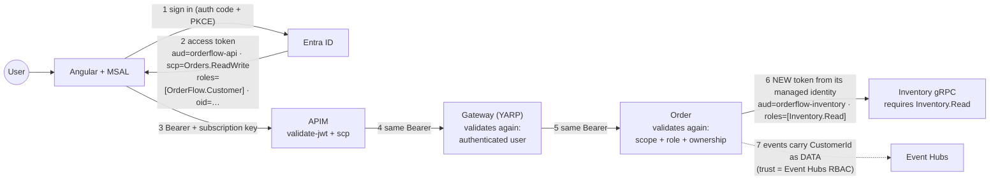
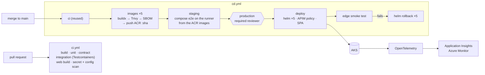
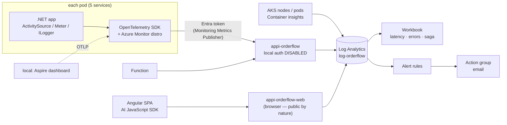

# Distributed-System-Architecture - Order

Event-driven order fulfilment across four independently deployable .NET services behind a reverse
proxy, coordinated by an orchestrated saga over Kafka, shipped as container images and run on
Azure Kubernetes Service behind API Management — without a single password or connection-string
secret anywhere in the system.

Placing an order touches stock, money and the customer's inbox — three things that live in three
different databases. OrderFlow does that without a distributed transaction: each service commits
locally, publishes a fact, and the saga remembers where it got to and what it owes.

```
                      ┌──────────────────────────────────────────────┐
   POST /api/v1/orders│                                              │
   ───────────────────▶  Gateway ── the only published address       │
        202 Accepted  │      │  YARP, routes on path                 │
                      │      ▼                                       │
                      │  Order  ── owns the order AND the saga       │
                      └──────┼───────────────────────────────────────┘
                             │  orderflow.orders.v1
             ┌───────────────┼────────────────────────────┐
             ▼               ▼                            ▼
       ┌───────────┐   ┌───────────┐               ┌──────────────┐
       │ Inventory │   │  Payment  │               │ Notification │
       └─────┬─────┘   └─────┬─────┘               └──────┬───────┘
             │               │                            │ Service Bus topic
  orderflow.inventory.v1 ────┤                            ▼
             └───────────────┴──────────▶ Order      Azure Function: email / sms
                  orderflow.payments.v1
```

Order also calls Inventory once **synchronously**, over gRPC, to ask whether the stock is likely
to be there. That call is advisory and read-only — reservations only ever happen through events.

## The saga

```
Pending ──▶ AwaitingStock ──▶ AwaitingPayment ──▶ Paid ──▶ Confirmed ■

   any failure ──▶ Compensating ──(every compensation ACKed)──▶ Cancelled ■
```

There is no rollback. A failure after stock was reserved runs the *compensation* for that step —
release the stock, refund the charge — and the saga only goes terminal once each compensation has
been acknowledged. A success that lands after the saga gave up (a payment captured past its
deadline) still records what it owes, because silence is never treated as proof of failure.

## Reliability

| Problem | Mechanism |
|---|---|
| Save and publish are not atomic | Transactional **outbox** in the service's own database; a background dispatcher publishes it |
| Kafka delivers at least once | **Inbox** keyed on `(MessageId, Consumer)` — the unique index is the guarantee, the pre-read is only an optimisation |
| A step never answers | A per-step `DeadlineUtc` and a scanner that times sagas out |
| Two messages hit one saga at once | `rowversion` optimistic concurrency |
| Two orders want the last unit | `rowversion` on the stock item |
| Charging twice | Inbox + a unique index on `Payment.OrderId` + the gateway idempotency key |
| A double-clicked submit button | `Idempotency-Key`, deduped by primary key inside the order's own transaction |
| A dependency is down | Graceful degradation: an unknown answer from the advisory gRPC call means "proceed" |
| A poison message | Bounded retries, then a `<topic>.dlq` parallel topic — never back onto the source |

Handlers never call `SaveChanges`. The dispatcher owns the transaction, so the business change,
the inbox claim and any new outbox rows commit together or not at all.

## The gateway

Callers know one address, not five. The gateway is the only thing published to the outside; the
services are unreachable except through it. It rejects anonymous requests before routing (a valid
user token for `orderflow-api`); what that user may do is decided by the service that owns the data.

Routing is entirely configuration — no C# decides where a request goes — so splitting a service
later changes one route here instead of every caller:

```json
"Routes": {
  "orders": {
    "ClusterId": "order",
    "AuthorizationPolicy": "authenticated-user",
    "Match": { "Path": "/api/v1/orders/{**catch-all}" }
  }
}
```

Destinations are resolved through service discovery, so `http://order` is a logical name that
Aspire resolves locally and that is ordinary DNS anywhere it runs as a deployed service.

## Health

Two endpoints, mapped in every environment, answering two different questions:

| | Asks | Consequence of a "no" |
|---|---|---|
| `/health/live` | Can the process execute code? | Restart it |
| `/health/ready` | Should it receive traffic right now? | Take it out of rotation |

Liveness checks nothing but itself. A dependency in there is a self-inflicted outage: one slow
database and every replica restarts at once, comes back to the same slow database, and restarts
again.

Readiness checks the service's own database and nothing else. Kafka and Service Bus are
deliberately excluded — if the broker is down, orders are still accepted and wait in the outbox,
so reporting unready would turn a broker blip into a checkout outage.

## On Azure

```
  Browser / curl
      │  HTTPS · Ocp-Apim-Subscription-Key · (Bearer token)
      ▼
  API Management ── CORS, rate limit, JWT validation, header hygiene
      │  HTTP
      ▼
  App Routing ingress (managed NGINX, public IP)
      ▼
  ┌─ AKS · namespace orderflow ─────────────────────────────────────────┐
  │  gateway ─▶ order ─gRPC─▶ inventory      payment      notification  │
  └────────────────┬───────────────┬─────────────┬─────────────┬────────┘
                   │               │             │             │
                   └──── Event Hubs (Kafka endpoint) ──────────┤
                                                               ▼
   ACR — images                              Service Bus topic "notifications"
   Azure SQL — one serverless DB per service   ├─ email ─▶ Function SendEmail
   Key Vault — payment's API key               └─ sms   ─▶ Function SendSms
```

| Local (Aspire / compose) | Azure |
|---|---|
| Kafka container | **Event Hubs** Standard, spoken to over its Kafka endpoint |
| SQL Server container | **Azure SQL**, Entra-only server, four serverless databases |
| RabbitMQ fanout | **Service Bus** topic with one subscription per channel, drained by an **Azure Function** |
| User secrets | **Key Vault** |
| The gateway's port | **APIM** → App Routing ingress → gateway |
| `docker compose` | **AKS**, deployed with one Helm chart |

The code barely changed to get there. The services still speak Kafka; only the bootstrap address
and the authentication mode differ, and both come from configuration.

### Zero secrets

Every service has its own user-assigned managed identity, federated to its Kubernetes
ServiceAccount through **Workload Identity**. A pod proves who it is with a token the cluster
issues, and Entra ID trades it for an access token — there is nothing to leak, rotate or check in.

| Resource | How the pod authenticates | Role |
|---|---|---|
| Azure SQL | `Authentication=Active Directory Default` | a contained database user per identity |
| Event Hubs | SASL `OAUTHBEARER` with an Entra token | Data Sender + Data Receiver |
| Service Bus | `ServiceBusClient` + `DefaultAzureCredential` | Data Sender (notification only) |
| Key Vault | configuration provider + `DefaultAzureCredential` | Secrets User (payment only) |
| ACR | the kubelet identity | AcrPull |

Local authentication is disabled on Service Bus and Event Hubs, and the SQL server accepts Entra
logins only, so a key or password would not work even if one existed. The generated Helm values
file contains hostnames and nothing else — it could be published without exposing anything.

Least privilege shows up in configuration too: only Payment is given the Key Vault URI, so the
others cannot even try to read a secret.

### The edge

APIM answers the CORS preflight first, because a browser's `OPTIONS` request carries neither a
subscription key nor a token. After that: a rate limit per subscription (`429`), JWT validation
(signature, issuer, audience, lifetime and the `Orders.ReadWrite` scope — always on), a correlation
id, and the subscription key stripped before the request reaches the cluster. Environment-specific values — tenant, audience, allowed origin —
are APIM named values, so the policy in
[`deploy/apim/orderflow-api-policy.xml`](deploy/apim/orderflow-api-policy.xml) is the same in every
environment.

Each service still validates the token itself. The ingress IP is public and `kubectl port-forward`
reaches any pod, so the edge is a first line of defence, not the only one.

### The web app

[`web/orderflow-web`](web/orderflow-web) is a small Angular 22 single-page app, hosted on **Azure
Static Web Apps**, that signs the user in with Entra ID (MSAL), places an order through APIM and
shows the saga as it happens.



- **One standalone component, no router.** `OrderPage` holds the form and the result, and its state
  lives in signals (`busy`, `error`, `status`, `history`).
- **Idempotent submit.** Each click sends a new `Idempotency-Key` (`crypto.randomUUID()`), so a
  retry or a double-click of the *same* submit can't create a second order.
- **Every saga step, not just the result.** The `202 Accepted` already says `Pending`, so that shows
  right away. The app then polls `/status` until the saga reaches `Confirmed` or `Cancelled`, and
  lists each state change with its time. `distinctUntilChanged` keeps it to one line per state.
- **Polling within APIM's rate limit.** The limit is 30 calls a minute per subscription. Polling
  once a second would use that up on a single order, so the app backs off (1 s, 2 s, 4 s, then
  5 s): a saga that settles in 10 s costs about four calls. A `429` is handled by waiting for
  `Retry-After` and polling again, because the order itself hasn't failed.
- **The failure path from the UI.** A unit price of **13.13** makes the fake payment gateway
  decline, so you can watch `Compensating` → `Cancelled` in the browser.
- **Sign-in with MSAL.** Auth code + PKCE via redirect; tokens live in `sessionStorage`, so they
  die with the tab. `MsalInterceptor` attaches `Authorization: Bearer …` only to calls to
  `apiBaseUrl` — never to another host.
- **Look up any order by id.** Exercises ownership (someone else's order is `404`) and the Support
  role (reads any order).
- **Helpful errors.** `0` (almost always CORS), `401`, `403` (signed in, but no OrderFlow role),
  `404` and `429` each get a sentence saying what to check instead of a bare status.
- **Static Web Apps config.** [`staticwebapp.config.json`](web/orderflow-web/public/staticwebapp.config.json)
  sends unknown routes to `index.html` and adds `nosniff` and a strict referrer policy to every
  response.

The APIM subscription key is not in git: `apimSubscriptionKey` in `src/environments/` is empty.
Paste the key from APIM (**Subscriptions**) before running or building, and don't commit it. It
still isn't a security boundary: the built JavaScript contains it, so it only identifies the app
for rate limiting and analytics. Who the user is comes from the bearer token, checked at every hop —
see [Security](#security).

### Notification fan-out

Kafka carries the **fact** (`OrderConfirmed`); Service Bus carries the **task** (send an email,
send an SMS). Each channel is its own subscription with its own retries and dead-letter queue, so a
broken SMS provider never delays an email.

The message id is deterministic — `{orderId}:{kind}` — and the topic has duplicate detection on, so
a Kafka redelivery that makes Notification send twice produces one message, not two. A message
whose customer id is `POISON` fails on purpose: it is retried ten times and then parked in the
dead-letter queue, which is how that path is demonstrated.

### Kubernetes

One chart, [`deploy/helm/orderflow-service`](deploy/helm/orderflow-service), and one small values
file per service. The five services differ only in image, ports, environment variables and whether
they get an ingress; five copies of the same templates would drift within a month.

- **Probes** — a startup probe gives slow first boots (serverless SQL waking up) room without
  weakening liveness; readiness is the database check described above.
- **Resources** — CPU and memory requests, a memory limit, and deliberately **no CPU limit**:
  CFS throttling causes latency spikes even on an idle node.
- **HPA + PDB** — scale on CPU, and never let a voluntary disruption take the last replica.
- **Zero-downtime rollouts** — `maxUnavailable: 0` plus readiness, so a deploy under load drops no
  requests.

Only the gateway has an ingress. Everything else is a `ClusterIP` Service.

### Where Event Hubs differs from Kafka

"Kafka-compatible" is not "Kafka":

- **Compression.** Event Hubs Standard rejects compressed batches with
  `Message format on broker does not support request`. Locally the producer uses Snappy; on Azure
  `Kafka__CompressionType` is `None`. The payloads are small JSON, so little is lost.
- **Topic creation.** Topics are provisioned as event hubs up front, so `Kafka__ProvisionTopics` is
  `false` in Azure.

## Security

Every hop proves who is calling and checks it again; nothing trusts the hop before it, because each
one can be bypassed (the ingress IP is public, `kubectl port-forward` reaches any pod).



| Caller | May | Token must carry | Enforced by |
|---|---|---|---|
| Signed-in **customer** | place orders; read **their own** orders | `aud`=orderflow-api · `scp` ∋ `Orders.ReadWrite` · `roles` ∋ `OrderFlow.Customer` | APIM (aud, scp) → gateway (valid user token) → Order (scope + role + ownership) |
| Signed-in **support** agent | read **any** order's status | … `roles` ∋ `OrderFlow.Support` | same; Order skips the ownership check |
| **Order** service (managed identity) | call Inventory's `CheckAvailability` | `aud`=orderflow-inventory · `roles` ∋ `Inventory.Read` | Inventory gRPC endpoint |
| Payment, Notification | — (no inbound API) | — | nothing to call; their trust boundary is Event Hubs RBAC |
| Anyone else | nothing | — | 401 at the first hop that sees them |

- **Identity comes from the token.** The customer id is the token's `oid`, never a field in the
  body. Someone else's order is a `404`, not a `403` — a `403` would confirm the id exists.
- **Scopes and roles.** The scope says *the SPA may call the API for this user*; it can't tell a
  customer from a support agent. App roles, assigned in Entra, can. The API requires assignment,
  so an unassigned user can't even get a token.
- **Service to service.** Order doesn't forward the user's token (wrong audience, and Inventory
  mustn't act with user rights); it asks Entra for an app-only token with its own managed identity.
- **Locally**, `Auth:Mode=Local` signs every request in as a developer principal shaped like a real
  token, so the same policies run under Aspire and compose. `X-Dev-User` / `X-Dev-Roles` override
  it per request. The switch throws at startup if the environment is `Production`.
- **The cluster** accepts only Entra identities (local accounts disabled, `kubelogin`), and the
  pipeline's deploy identity may write to the `orderflow` namespace only (ADR-0019).
- **NetworkPolicies** in Azure: the gateway accepts connections only from the ingress controller,
  Order only from the gateway, Inventory only from Order (gRPC port), Payment and Notification from
  nobody.
- **Supply chain.** Trivy gates images on fixable HIGH/CRITICAL CVEs and scans the chart and
  Dockerfiles for misconfiguration; gitleaks scans the full history for committed secrets; actions
  are pinned by commit SHA; Dependabot opens grouped update PRs weekly.

**Zero secrets** (see [above](#zero-secrets)) is checked, not claimed:
[`deploy/scripts/secrets-audit.sh`](deploy/scripts/secrets-audit.sh) prints PASS/FAIL for every
setting that would bring a shared secret back if flipped. The threat model — assets, trust
boundaries, STRIDE threats, and the gaps accepted on purpose — is in
[`docs/security.md`](docs/security.md). The app registrations are recorded in
[`infra/entra-apps.md`](infra/entra-apps.md).

## Delivery & observability



- **Build once, promote the same image.** Every image is tagged with the commit SHA, scanned once,
  and that exact tag is what staging and production run. GitHub logs in to Azure with OIDC
  federation — no secret is stored in GitHub.
- **Environments and gates.** `staging` is ephemeral: the five images run with docker compose on
  the runner and a smoke test drives the happy path, compensation, idempotency and ownership.
  `production` needs a required reviewer and deploys from `main` only.
- **Rolling back.** A failed production deploy rolls every release back to the revision recorded
  before it started. To redeploy an earlier build by hand: `gh workflow run rollback.yml -f sha=<sha>`.



One order is one trace across every hop, including the Kafka hops: the outbox row stores the W3C
`traceparent` of the transaction that wrote it. Alerts: `orderflow-dead-letters`,
`orderflow-saga-stuck`, `orderflow-outbox-failing`, `orderflow-error-rate`, `orderflow-latency`,
`orderflow-pod-restarts`. The workbook queries are in [`deploy/monitoring`](deploy/monitoring).

## Stack

.NET 10 · ASP.NET Core · EF Core (SQL Server) · Kafka · gRPC · YARP · .NET Aspire · Docker ·
OpenTelemetry · xUnit · Testcontainers · PactNet

**Web:** Angular 22 (standalone components, signals) · RxJS · TypeScript

**Azure:** AKS · Helm · ACR · API Management · Event Hubs · Service Bus · Azure Functions
(isolated worker) · Azure SQL (serverless) · Key Vault · Entra ID (MSAL, app roles, Workload
Identity) · Static Web Apps · Application Insights

## Running it

Requires the .NET 10 SDK and a container runtime.

```bash
dotnet run --project src/Aspire/OrderFlow.AppHost
```

Aspire starts Kafka, RabbitMQ and SQL Server, provisions a database per service, and launches the
services and the gateway with service discovery wired up; its dashboard collects the traces, logs
and metrics for the whole system in one place. Each service migrates its own schema on startup,
and Inventory seeds a small catalogue — `SKU-1`, `SKU-2`, `SKU-3`, plus `SKU-OOS` with nothing on
hand so the reservation-failure path is reachable without editing the database by hand.

Migrating on startup is opt-out, so a dedicated migration step can take it over:

```bash
Database__MigrateOnStartup=false
```

### Everything in containers

```bash
docker compose --profile apps up --build
```

Builds all five images and runs them against the same infrastructure. Only the gateway publishes a
port, so the services are reachable exactly as they would be in a cluster — through the gateway or
not at all.

To bring up only the infrastructure and debug the services from an IDE:

```bash
docker compose up -d
```

To build a single image by hand:

```bash
docker build -f src/Services/Inventory/OrderFlow.Inventory.Api/Dockerfile \
             -t orderflow/inventory-api:local .
```

### On Azure

Requires the Azure CLI, `kubectl` and Helm — and Git Bash on Windows. Every name lives in
[`infra/env.sh`](infra/env.sh); source it in each new shell, because an empty variable is behind
most "can't find app" errors.

```bash
source infra/env.sh

# Once: the platform, the identities and the database users
bash infra/provision.sh          # RG, ACR, AKS, SQL, Event Hubs, Service Bus, Key Vault
bash infra/identities.sh         # managed identities, federated credentials, role assignments
bash infra/entra-apps.sh         # app registrations, app roles, Order's Inventory.Read (infra/entra-apps.md)
bash infra/aks-entra-rbac.sh     # AKS: Entra ID + Azure RBAC, local accounts off (ADR-0019)
#   + run infra/sql/create-service-users.sql in each database (as the Entra admin)
#   + az keyvault secret set --vault-name "$KV" -n PaymentGateway--ApiKey --value <key>
az aks get-credentials -g "$RG" -n "$AKS" --overwrite-existing
kubelogin convert-kubeconfig -l azurecli         # kubectl authenticates through Entra ID

# Every release
export TAG=$(date +%Y%m%d-%H%M)              # a new tag, so the pods really roll
deploy/scripts/build-images.sh acr           # builds inside ACR, no local Docker needed
deploy/scripts/write-azure-values.sh         # -> deploy/helm/values/azure.generated.yaml
bash deploy/scripts/helm-deploy.sh azure     # inventory -> payment -> notification -> order -> gateway
kubectl get pods,ingress -n orderflow
```

`helm-deploy.sh` waits for each release to be ready before starting the next. If one times out,
Helm marks it `failed` and the script stops; fix the pod and run it again — every release is an
idempotent `upgrade --install`.

The ingress address is what APIM's backend points at:

```bash
kubectl get ingress gateway -n orderflow -o jsonpath='{.status.loadBalancer.ingress[0].ip}'
```

The notification Function is published separately:

```bash
cd src/Functions/OrderFlow.Notifications.Functions && func azure functionapp publish "$FUNC"
```

The edge end to end — 401 without a key, an order reaching `Confirmed`, 429 under load, Service Bus
duplicate detection and dead-lettering — is checked by one script:

```bash
KEY=<APIM subscription key> bash deploy/scripts/test-day5.sh
```

Locally, Notification publishes to Service Bus too. Point it at the Azure namespace with
`ServiceBus__FullyQualifiedNamespace`; after `az login`, `DefaultAzureCredential` uses your identity.

### The web app

Requires Node.js and npm.

```bash
cd web/orderflow-web
npm ci
# paste the APIM subscription key into src/environments/ first (never commit it)
npx ng serve                                  # http://localhost:4200 -> Sign in
npx ng build --configuration production       # -> dist/orderflow-web/browser, what Static Web Apps serves
```

`apiBaseUrl` in `src/environments/` decides which backend the app calls: the APIM URL for Azure,
or `http://localhost:8080` for the compose stack. If you run it on localhost against APIM, add
`http://localhost:4200` to the allowed origins in APIM.

## API

Through the gateway on `:8080` under compose; under Aspire, the gateway's port is on the dashboard;
on Azure, through `https://<apim-name>.azure-api.net/orderflow` with an `Ocp-Apim-Subscription-Key`
header and an Entra access token for `orderflow-api`
(`az account get-access-token --resource api://<orderflow-api client id>`). Locally the services
run with `Auth:Mode=Local`: no token needed, and `X-Dev-User` / `X-Dev-Roles` act as someone else.

```bash
# Place an order. 202 with a poll URL: the work finishes asynchronously, so 201 would be a lie.
curl -X POST http://localhost:8080/api/v1/orders \
  -H 'Content-Type: application/json' \
  -H 'Idempotency-Key: 8f14e45f-ea8d-4b9a-9c1e-2b7d6f0a1c33' \
  -d '{
        "currency": "USD",
        "lines": [{ "sku": "SKU-1", "quantity": 2, "unitPrice": 19.99 }]
      }'

# Follow the saga
curl http://localhost:8080/api/v1/orders/{id}/status
# -> { "orderId": "...", "customerId": "<oid>", "state": "AwaitingPayment", "failureReason": null, ... }

# The same order as another customer: 404, not 403
curl -i http://localhost:8080/api/v1/orders/{id}/status \
  -H 'X-Dev-User: 22222222-2222-2222-2222-222222222222' -H 'X-Dev-Roles: OrderFlow.Customer'
```

There is no `customerId` in the body: who is ordering is the token's `oid`.

Repeating a POST with the same `Idempotency-Key` returns the original order rather than creating a
second one.

The payment gateway stand-in is deterministic by amount, so the failure paths run end to end: a
total of **13.13** is declined permanently (order cancelled, stock released), **66.66** times out
retryably, and anything else succeeds.

## Tests

```bash
dotnet build
dotnet test
```

Four suites, split by what each one can actually prove:

- **Unit** — the saga state machine and inbox duplicate detection. Pure logic, and the
  compensation races are where the bugs live.
- **Integration** — real SQL Server through Testcontainers. An in-memory provider would pass while
  production stayed broken: the outbox query is `UPDLOCK, READPAST` and duplicate detection reads
  SQL Server error codes 2627 and 2601. The fixture migrates rather than calling `EnsureCreated`,
  so a bad migration fails in a test instead of in a deployment.
- **Broker** — one full round trip across a real Kafka broker (outbox row → dispatcher → topic →
  consumer → handler → inbox claim), plus a dead-letter test that parks a poison message and
  asserts the good message behind it on the same partition still gets handled.
- **Contract** — Pact message pacts with the real code on both sides: the consumer test invokes
  Inventory's actual handler, the provider test builds the event through Order's real aggregate
  and mapper, and both match on type and shape rather than on values.


